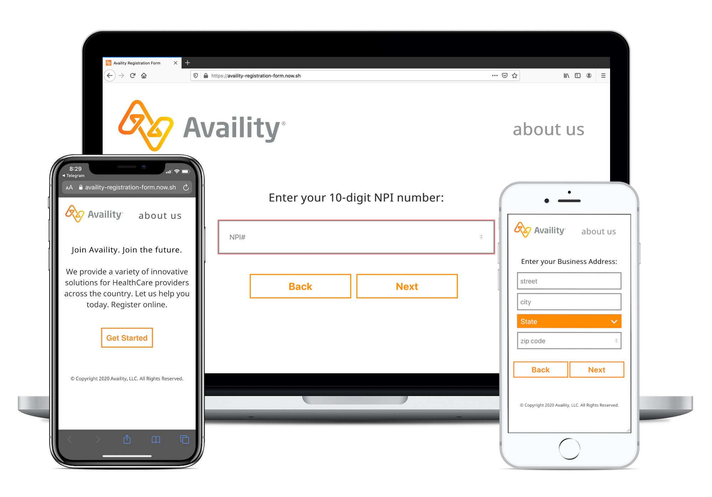

# Availity. Registration form.

We created a registration form for HealthCare providers who wants to be a part of the Availity system. Now they can join Availity electronically .

The form is designed to collect the following info from the providers:

- First and Last Name
- NPI number
- Business Address
- Telephone Number
- Email address

The form was build following the **"mobile-first"** approach. It's fully scalable.

Techonologies I used to build this:
React (Context, Hooks), Node/Express, CSS, HTML.

To run the rendering test use the following command:
**"npm run test"**

Check out the [live page](https://availity-registration-form.now.sh).
